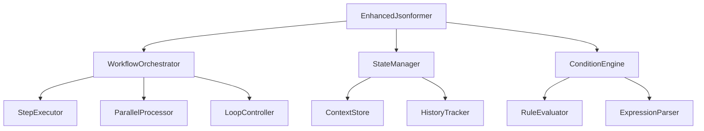
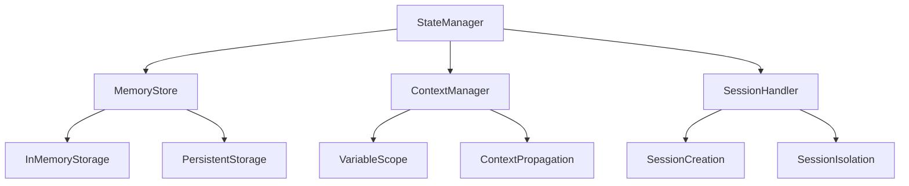
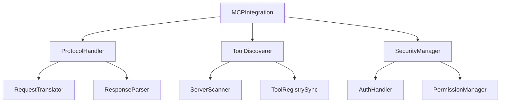
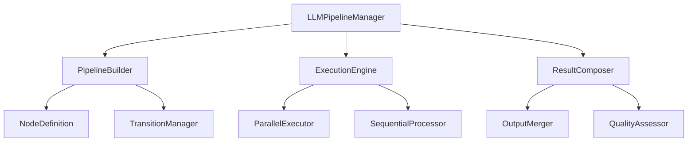
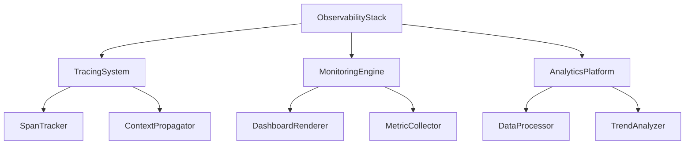
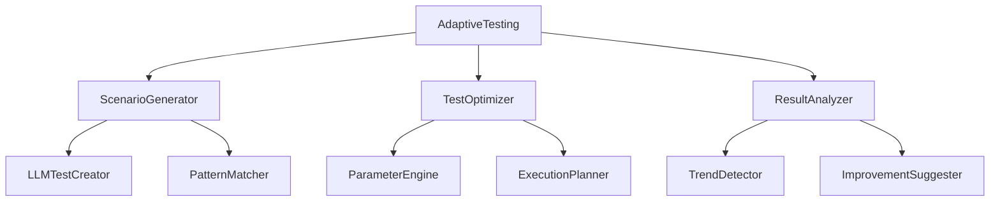

# GenerativeJson: Agentic Testing Ecosystem - Gap Analysis and Implementation Plan

## Overview

This document provides a comprehensive analysis of gaps in GenerativeJson's current capabilities for agentic testing and outlines a strategic plan to bridge these gaps. The focus is on transforming GenerativeJson into a universal agentic testing platform by leveraging existing components and implementing targeted enhancements.

## Current State Assessment

### Core Capabilities Present
1. **Structured Data Generation**: Robust JSON Schema-based data generation with support for complex nested structures
2. **Multi-LLM Backend Support**: Ollama, OpenAI, HuggingFace Transformers integration with unified interface
3. **Tool Registry System**: Dynamic tool registration and execution with local and remote tool support
4. **API Infrastructure**: FastAPI-based REST endpoints with OpenAPI documentation
5. **Output Formatting**: JSON, YAML, XML, CSV support with POML (Plain Object Markup Language) formatting
6. **Validation Framework**: JSON Schema validation capabilities with extended support for YAML, XML, CSV, and POML formats

### Critical Gaps for Agentic Testing

#### 1. Workflow Orchestration
- **Gap**: Linear execution model without complex workflows
- **Impact**: Cannot test multi-step agent interactions with branching and parallel execution
- **Current Limitation**: Jsonformer executes single generation tasks without workflow definition

#### 2. State Management
- **Gap**: No persistent context across agent interactions, relational mapping or cross reference between tasks for dependent entities
- **Impact**: Cannot simulate real agent conversations or workflows or multi-step tasks or chains
- **Current Limitation**: Each execution is stateless with no memory retention

#### 3. Native MCP Support
- **Gap**: Limited Model Calling Protocol integration
- **Impact**: Cannot leverage secure external tool ecosystems with authentication
- **Current Limitation**: Basic tool registration only without dynamic discovery

#### 4. Advanced LLM Chaining
- **Gap**: Sequential LLM interactions without optimization
- **Impact**: Inefficient complex reasoning workflows with redundant processing
- **Current Limitation**: No pipeline or parallel execution with result composition

#### 5. Observability and Tracing
- **Gap**: Basic logging without comprehensive monitoring
- **Impact**: Difficult to debug and optimize agent workflows in production
- **Current Limitation**: No distributed tracing or metrics collection

#### 6. Adaptive Testing Capabilities
- **Gap**: Static test scenarios without dynamic generation
- **Impact**: Limited coverage of edge cases and real-world scenarios
- **Current Limitation**: Manual test case creation only without self-improvement

## Gap Bridging Strategy

### Core Principle: Build Upon Existing Strengths
Rather than rebuilding from scratch, we'll enhance existing components to fill gaps while maintaining backward compatibility:

1. **Extend Jsonformer** → Workflow Engine with state management and conditional execution
2. **Enhance ToolRegistry** → MCP-Enabled Tool Orchestrator with dynamic discovery and secure execution
3. **Augment ModelBackends** → LLM Pipeline Manager with parallel processing and result composition
4. **Expand API Layer** → Distributed Agent Coordinator with load balancing and fault tolerance
5. **Improve Validation** → Cross-Context Validator with multi-format support and adaptive rules
6. **Evolve Formatting** → Structured Test Reporter with customizable templates and export formats

## Detailed Gap Analysis and Solutions

### Gap 1: Workflow Orchestration

#### Current State
- Single execution path in Jsonformer with no workflow definition capabilities
- No conditional logic or branching based on intermediate results
- No loop support with exit conditions and iteration control
- No parallel execution with resource management

#### Required Capabilities
- Multi-step workflow definition with YAML/JSON configuration support
- Conditional execution based on results with expression evaluation
- Looping with exit conditions, iteration limits, and break/continue support
- Parallel workflow branches with concurrency control and synchronization
- Error handling and recovery with retry mechanisms and fallback strategies

#### Bridging Solution: Workflow Engine Extension

#### Implementation Plan
1. Extend Jsonformer with workflow configuration support using JSON/YAML DSL
2. Implement step execution engine with dependency resolution and execution order
3. Add conditional logic processing with JavaScript-like expression evaluation
4. Create loop control mechanisms with iteration tracking and exit condition evaluation
5. Enable parallel execution capabilities with thread pool management and resource allocation

### Gap 2: State Management

#### Current State
- Stateless execution model with no memory retention between calls
- No context persistence for maintaining state across workflow steps
- No conversation history tracking for agent interactions
- No shared memory across operations for data exchange

#### Required Capabilities
- Persistent agent state with key-value storage and object serialization
- Conversation context management with hierarchical scoping and lifetime control
- Shared memory across workflow steps with thread-safe access and updates
- Session-based state isolation with security boundaries and access control
- State serialization/deserialization with support for JSON, YAML, and binary formats

#### Bridging Solution: Advanced State Manager

#### Implementation Plan
1. Implement context-aware state management with hierarchical variable scoping
2. Add persistent storage for long-running workflows using SQLite and Redis backends
3. Create session isolation mechanisms with UUID-based session identifiers
4. Enable state serialization for distributed execution with protocol buffers and JSON
5. Add state versioning and rollback capabilities with snapshot management

### Gap 3: Native MCP Support

#### Current State
- Basic tool registration
- No protocol-level integration
- No dynamic tool discovery
- No secure tool execution

#### Required Capabilities
- Full MCP protocol implementation
- Dynamic tool discovery and registration
- Secure authentication and authorization
- Tool composition and chaining
- Error handling for remote tools

#### Bridging Solution: MCP Integration Layer

#### Implementation Plan
1. Implement MCP protocol handlers
2. Add dynamic tool discovery mechanisms
3. Create secure authentication framework
4. Enable tool composition capabilities
5. Add comprehensive error handling

### Gap 4: Advanced LLM Chaining

#### Current State
- Sequential LLM interactions
- No pipeline optimization
- No result composition
- No feedback loops

#### Required Capabilities
- Complex LLM pipeline definition
- Parallel LLM execution
- Intelligent result composition
- Feedback-driven refinement
- Pipeline optimization

#### Bridging Solution: LLM Pipeline Manager

#### Implementation Plan
1. Implement pipeline definition language with YAML/JSON configuration support
2. Add parallel execution capabilities with resource pooling and load balancing
3. Create result composition mechanisms with intelligent merging and conflict resolution
4. Enable feedback loop processing with iterative refinement and quality assessment
5. Add pipeline optimization algorithms with cost-based optimization and caching strategies

### Gap 5: Observability and Tracing

#### Current State
- Basic console logging with no structured logging capabilities
- No distributed tracing for multi-service workflows
- No performance metrics collection or analysis
- No real-time monitoring with alerting mechanisms

#### Required Capabilities
- Full-stack distributed tracing with OpenTelemetry integration
- Real-time monitoring dashboards with customizable visualizations
- Performance metrics collection with latency, throughput, and error rate tracking
- Alerting and notification with escalation policies and integration support
- Historical analysis with trend detection and anomaly identification

#### Bridging Solution: Observability Stack

#### Implementation Plan
1. Implement distributed tracing system with OpenTelemetry SDK and Jaeger backend
2. Add real-time monitoring capabilities with Grafana dashboards and Prometheus metrics
3. Create performance metrics collection with latency histograms and error rate tracking
4. Enable alerting and notification with Slack, email, and webhook integrations
5. Build historical analysis tools with trend detection and predictive analytics

### Gap 6: Adaptive Testing

#### Current State
- Static test scenarios with no dynamic variation
- Manual test case creation with limited coverage
- No dynamic generation based on system behavior
- No self-improving tests with feedback loops

#### Required Capabilities
- Dynamic test case generation using LLM-powered prompt engineering
- AI-driven scenario creation with edge case identification
- Adaptive test execution with runtime parameter adjustment
- Self-improving test suites with coverage feedback and optimization
- Coverage optimization with genetic algorithms and reinforcement learning

#### Bridging Solution: Adaptive Testing Framework

#### Implementation Plan
1. Implement AI-driven test generation using prompt templates and LLM fine-tuning
2. Add adaptive execution logic with runtime feedback and parameter optimization
3. Create self-improving mechanisms with coverage analysis and test evolution
4. Enable coverage optimization using genetic algorithms for test suite refinement
5. Add intelligent test prioritization with risk-based testing and failure prediction

## Core Implementation Plan

### Phase 1: Foundation Enhancement (Months 1-2)

#### Objective: Establish core agentic capabilities
#### Key Deliverables:
1. Enhanced Jsonformer with workflow support and conditional execution
2. Advanced state management system with persistent storage
3. Basic MCP protocol implementation with tool discovery
4. Initial observability framework with distributed tracing

#### Tasks:
1. Extend Jsonformer class with workflow configuration and step management
2. Implement state persistence mechanisms using in-memory and disk-based storage
3. Add MCP request/response handlers with authentication support
4. Create basic tracing infrastructure with OpenTelemetry integration
5. Build conditional execution engine with expression evaluation

### Phase 2: Advanced Orchestration (Months 3-4)

#### Objective: Enable complex agent workflows
#### Key Deliverables:
1. Full workflow orchestration engine with parallel processing
2. Parallel execution capabilities with resource management
3. Advanced MCP integration with dynamic tool discovery
4. Comprehensive observability with real-time dashboards

#### Tasks:
1. Implement parallel workflow execution with concurrency control
2. Add loop control mechanisms with exit condition evaluation
3. Complete MCP tool discovery with server scanning capabilities
4. Enhance tracing with distributed context propagation
5. Add real-time monitoring with alerting mechanisms

### Phase 3: Intelligent Testing (Months 5-6)

#### Objective: Implement adaptive testing capabilities
#### Key Deliverables:
1. AI-driven test generation with LLM-powered scenario creation
2. Self-improving test suites with coverage optimization
3. Advanced analytics platform with trend analysis
4. Integration with external systems and CI/CD pipelines

#### Tasks:
1. Implement dynamic test case generation using prompt engineering
2. Add adaptive execution logic with feedback loops
3. Create analytics and reporting with visualization dashboards
4. Build integration connectors for popular testing frameworks
5. Enable community plugin system with package management

## Resource Requirements

### Technical Resources
1. **Development Team**: 3-5 engineers with AI/ML and backend expertise
2. **Infrastructure**: Cloud resources for testing and development
3. **Tools**: Development environments, CI/CD pipelines, monitoring tools
4. **Documentation**: Technical writers for comprehensive documentation

### Timeline Dependencies
1. **MCP Standard Finalization**: Wait for stable MCP specification
2. **LLM Provider Updates**: Adapt to new LLM capabilities
3. **Community Feedback**: Incorporate user feedback during development
4. **Market Validation**: Validate approach with pilot users

## Risk Assessment and Mitigation

### Technical Risks

#### 1. Complexity Overload
- **Risk**: Over-engineering leading to usability issues
- **Mitigation**: Incremental development with frequent user feedback
- **Contingency**: Simplify features based on adoption metrics

#### 2. Performance Degradation
- **Risk**: Enhanced features slowing down core functionality
- **Mitigation**: Asynchronous processing and caching strategies
- **Contingency**: Performance optimization sprints

#### 3. Integration Challenges
- **Risk**: Difficulty integrating with diverse LLM providers
- **Mitigation**: Standardized adapter patterns
- **Contingency**: Fallback to core provider support

### Market Risks

#### 1. Competition
- **Risk**: Other platforms gaining market share
- **Mitigation**: Focus on unique agentic testing capabilities
- **Contingency**: Accelerate roadmap for key differentiators

#### 2. Technology Shifts
- **Risk**: Rapid changes in LLM landscape
- **Mitigation**: Modular architecture for easy adaptation
- **Contingency**: Regular technology assessment cycles

## Success Metrics and KPIs

### Technical Metrics
1. **Workflow Complexity**: Support for 10+ step workflows with branching, looping, and parallel execution
2. **Execution Performance**: <100ms overhead for enhanced features with <10ms latency for simple operations
3. **Scalability**: Support for 1000+ concurrent agent workflows with auto-scaling capabilities
4. **Reliability**: 99.9% uptime for core services with <1% error rate

### Adoption Metrics
1. **Active Users**: 500+ monthly active users within 6 months with 20% MoM growth
2. **Integration Partners**: 20+ integrations with popular frameworks (Jest, PyTest, etc.)
3. **Community Engagement**: 100+ GitHub contributors with 50+ pull requests/month
4. **Plugin Ecosystem**: 50+ third-party plugins with 1000+ downloads/month

### Business Metrics
1. **Time-to-Value**: <1 hour for basic agentic testing setup with <10 min for advanced workflows
2. **Cost Reduction**: 50% reduction in manual testing effort with 30% reduction in bug-fix cycles
3. **Quality Improvement**: 70% reduction in production bugs with 90% increase in test coverage
4. **Developer Satisfaction**: 4.5+ rating in user surveys with Net Promoter Score > 70

## Future Evolution Path

### Short-term (6-12 months)
1. Full agentic testing platform launch with comprehensive documentation and tutorials
2. Integration with major testing frameworks including Jest, PyTest, Mocha, and JUnit
3. Enterprise security features with role-based access control and audit logging
4. Advanced analytics and reporting with customizable dashboards and export capabilities

### Medium-term (1-2 years)
1. Multi-agent collaboration capabilities with inter-agent communication protocols
2. Cross-platform deployment supporting cloud, edge, and on-premises environments with Kubernetes orchestration
3. Industry-specific testing templates for finance, healthcare, e-commerce, and government sectors
4. AI-assisted test maintenance with auto-refactoring, optimization, and bug prediction
5. Professional branding with logo design and comprehensive project description for the repository
6. Detailed future scope and roadmap documentation in the README with version planning

### Long-term (2+ years)
1. Autonomous testing agent ecosystem with self-organizing test suites
2. Predictive testing and prevention with anomaly detection and proactive issue identification
3. Global testing network with distributed agent coordination
4. Cognitive testing intelligence with reasoning and decision-making capabilities
5. Enhanced repository presentation with professional branding and comprehensive documentation
6. Complete roadmap integration in project documentation and community engagement

## Conclusion

This plan transforms GenerativeJson from a structured data generation library into a comprehensive agentic testing ecosystem by strategically bridging identified gaps. By leveraging existing core components and implementing targeted enhancements, we can create a powerful platform for testing complex AI agent workflows while maintaining backward compatibility and ensuring future adaptability.

The phased approach minimizes risk while delivering value incrementally, and the focus on industry trends ensures the platform remains relevant as the agentic AI landscape evolves.